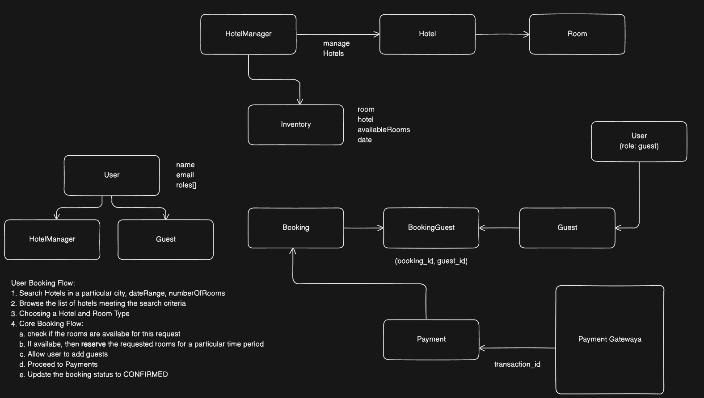
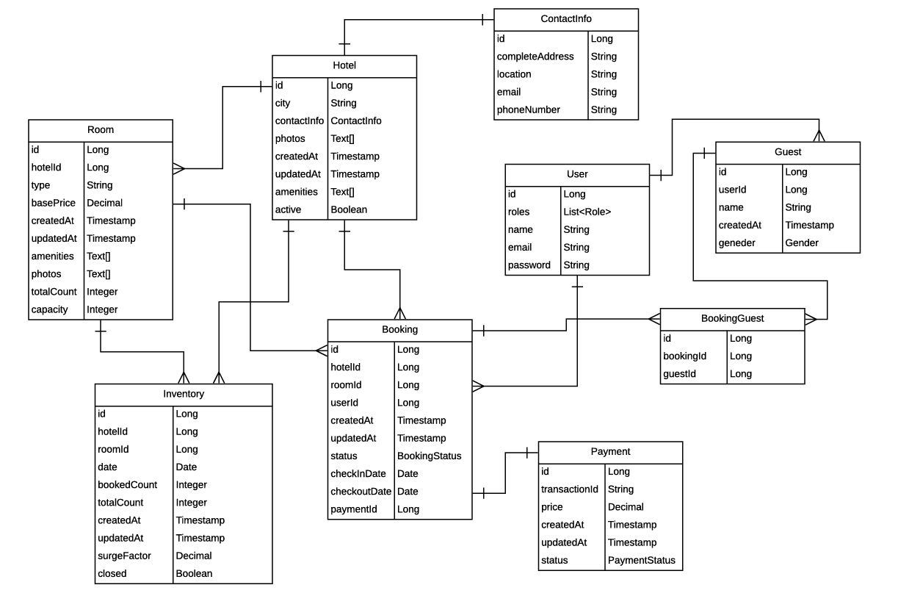
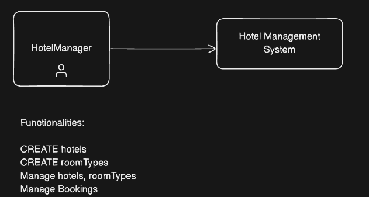
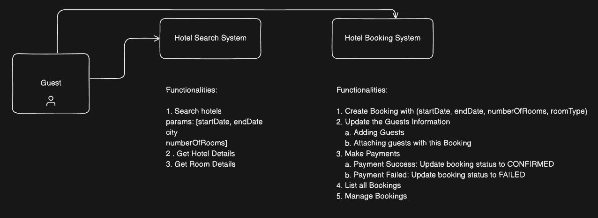
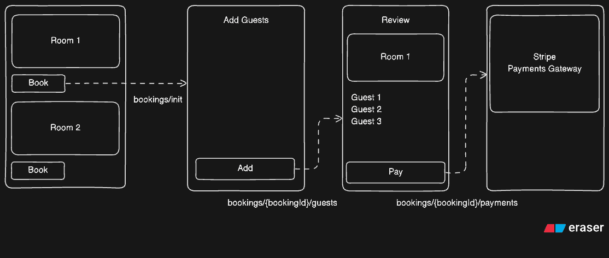
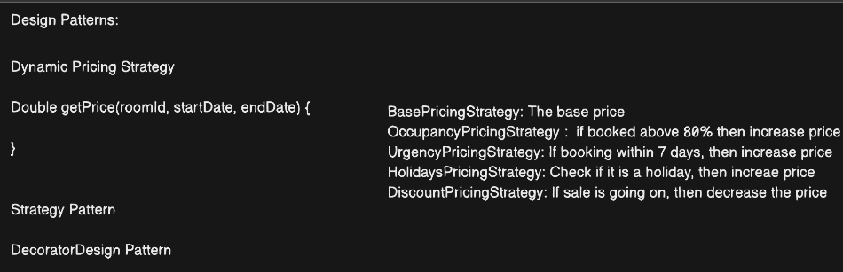
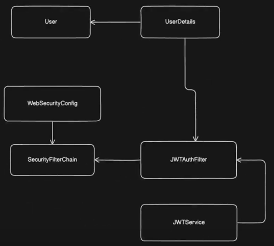
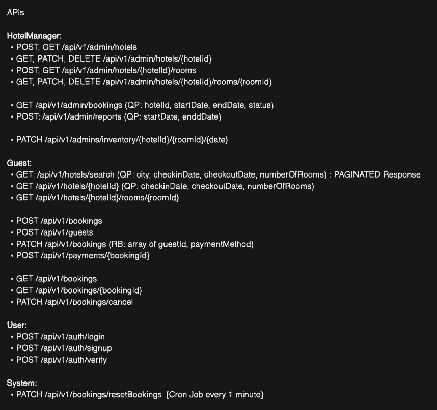

# StayEase Backend

StayEase is a hotel booking backend built with Spring Boot. It models the core workflows of a real hotel-booking platform: hotel and room management, date-wise inventory, dynamic pricing, hotel discovery, booking reservations, guest management, JWT-based authentication and authorization, Stripe Checkout payments, refunds, reporting, and concurrency-safe inventory updates.

The project was designed as a backend-focused portfolio project, with the implementation organized around clear service boundaries, JPA entities, DTOs, repository queries, Spring Security, transactional booking flows, and design-pattern-based pricing.

## Table of Contents

- [Project Highlights](#project-highlights)
- [Tech Stack](#tech-stack)
- [High-Level Architecture](#high-level-architecture)
- [Project Structure](#project-structure)
- [Domain Model](#domain-model)
- [Authentication and Authorization](#authentication-and-authorization)
- [Hotel and Room Management](#hotel-and-room-management)
- [Inventory Management](#inventory-management)
- [Dynamic Pricing and Decorator Pattern](#dynamic-pricing-and-decorator-pattern)
- [Hotel Search](#hotel-search)
- [Booking Lifecycle](#booking-lifecycle)
- [Concurrency and Pessimistic Locking](#concurrency-and-pessimistic-locking)
- [Stripe Payment and Refund Flow](#stripe-payment-and-refund-flow)
- [Guest Management](#guest-management)
- [Hotel Reporting](#hotel-reporting)
- [Standard API Responses and Error Handling](#standard-api-responses-and-error-handling)
- [REST API Reference](#rest-api-reference)
- [Request Examples](#request-examples)
- [Project Diagrams](#project-diagrams)
- [Running the Project Locally](#running-the-project-locally)
- [Swagger / OpenAPI](#swagger--openapi)
- [Implementation Notes](#implementation-notes)
- [Possible Improvements](#possible-improvements)

---

## Project Highlights

StayEase currently includes:

- Hotel manager and guest user roles
- JWT access-token authentication
- Refresh token stored in an HttpOnly cookie
- BCrypt password hashing
- Role-based authorization for hotel-management APIs
- Hotel CRUD operations
- Room-type management
- One-year date-wise inventory generation
- Room inventory updates over a date range
- Dynamic pricing using the Decorator Design Pattern
- Hourly scheduled price recalculation
- Precomputed per-hotel daily minimum prices
- Hotel search by city and date range
- Booking initialization with temporary room reservation
- 10-minute booking-expiration guard
- Guest addition to bookings
- Stripe Checkout Session creation
- Stripe webhook handling
- Booking confirmation after successful payment
- Booking cancellation and Stripe refunds
- Pessimistic database locking for inventory-sensitive operations
- User profile and saved guest management
- Hotel-manager booking reports
- Global success-response wrapping
- Centralized exception handling
- PostgreSQL-backed persistence
- OpenAPI / Swagger UI integration

---

## Tech Stack

| Area | Technology |
|---|---|
| Language | Java 21 |
| Backend Framework | Spring Boot 4.1 |
| Web | Spring Web MVC |
| Persistence | Spring Data JPA / Hibernate |
| Database | PostgreSQL |
| Security | Spring Security |
| Authentication | JWT using JJWT |
| Password Hashing | BCrypt |
| Payments | Stripe Java SDK |
| Object Mapping | ModelMapper |
| API Documentation | Springdoc OpenAPI / Swagger UI |
| Boilerplate Reduction | Lombok |
| Build Tool | Maven |
| Scheduling | Spring Scheduling |
| Concurrency | JPA Pessimistic Write Locks |

The application uses PostgreSQL-specific `TEXT[]` columns for hotel and room photo/amenity arrays.

---

## High-Level Architecture

The backend follows a standard layered Spring architecture:

```text
Client
  |
  v
Controllers
  |
  v
Services / Business Logic
  |
  +----------------------+
  |                      |
  v                      v
Repositories          Stripe API
  |
  v
PostgreSQL
```

Cross-cutting concerns are handled separately:

```text
Incoming Request
      |
      v
Spring Security Filter Chain
      |
      v
JWTAuthFilter
      |
      v
SecurityContext
      |
      v
Controller
      |
      v
Service
```

The main layers are:

- **Controller layer**: HTTP endpoints and request/response handling
- **Service layer**: booking, pricing, inventory, payment, authorization, and reporting logic
- **Repository layer**: Spring Data repositories, JPQL queries, locking, and bulk updates
- **Entity layer**: persistent domain model
- **DTO layer**: API-facing request and response models
- **Security layer**: JWT creation/parsing, authentication filter, authorization rules
- **Advice layer**: standardized API responses and exception handling
- **Strategy layer**: composable dynamic-pricing rules

---

## Project Structure

```text
src/main/java/dev/aryank/stayease
|
├── advice
│   ├── ApiError
│   ├── ApiResponse
│   ├── GlobalExceptionHandler
│   └── GlobalResponseHandler
│
├── config
│   ├── MapperConfig
│   └── StripeConfig
│
├── controller
│   ├── AuthController
│   ├── HotelBookingController
│   ├── HotelBrowseController
│   ├── HotelController
│   ├── InventoryController
│   ├── RoomAdminController
│   ├── UserController
│   └── WebhookController
│
├── dto
├── entity
├── exception
├── repository
├── security
├── service
├── strategy
└── util
```

The project diagrams are stored under:

```text
docs/diagrams/
```

---

## Domain Model

The core entities are:

### User

A registered application user.

Important fields:

- `email`
- encoded `password`
- `name`
- `dateOfBirth`
- `gender`
- `roles`

Supported roles:

```text
GUEST
HOTEL_MANAGER
```

`User` implements Spring Security's `UserDetails`, allowing the same entity to be used as the authenticated principal.

### Hotel

Represents a hotel managed by a `HOTEL_MANAGER`.

Important fields:

- name
- city
- photos
- amenities
- embedded contact information
- active status
- owner
- rooms

A newly created hotel starts as inactive. Activating the hotel also initializes inventory for its existing room types.

### HotelContactInfo

Embedded inside `Hotel`.

```text
address
phoneNumber
email
location
```

### Room

A `Room` represents a **room type**, not an individual physical room.

Examples:

```text
Deluxe
Standard
Executive Suite
Presidential Suite
```

Important fields:

- type
- base price
- photos
- amenities
- total room count
- capacity
- hotel

This is an important domain decision: physical availability is not represented by individual room rows. It is represented by the `Inventory` entity.

### Inventory

Stores availability and pricing information for one room type on one date.

Conceptually:

```text
Hotel + Room Type + Date -> Inventory Row
```

Important fields:

- `date`
- `totalCount`
- `bookedCount`
- `reservedCount`
- `surgeFactor`
- `price`
- `closed`
- `city`

The combination of hotel, room and date is unique.

### Booking

Represents the booking lifecycle.

Important fields:

- hotel
- room
- authenticated user
- room count
- check-in/check-out dates
- status
- guests
- total amount
- Stripe payment session ID
- timestamps

Booking states:

```text
RESERVED
GUESTS_ADDED
PAYMENT_PENDING
CONFIRMED
CANCELLED
EXPIRED
```

### Guest

Stores traveler information belonging to a user.

Important fields:

- user
- name
- gender
- date of birth

Bookings and guests use a many-to-many relation through:

```text
booking_guest
```

### HotelMinPrice

Stores the cheapest computed room price for a hotel on a particular date.

This table is refreshed by the scheduled pricing service and is used to make hotel browse/search pricing cheaper to query.

---

## Authentication and Authorization

StayEase uses stateless JWT authentication with Spring Security.

### Signup

A new user signs up through:

```http
POST /api/v1/auth/signup
```

The password is encoded with `BCryptPasswordEncoder`.

New signups are assigned:

```text
GUEST
```

by default.

### Login

Login is performed through Spring Security's `AuthenticationManager`:

```text
Email + Password
      |
      v
AuthenticationManager
      |
      v
UserDetailsService
      |
      v
UserRepository.findByEmail(...)
      |
      v
BCrypt password verification
```

After successful authentication, StayEase creates:

- **Access token**: 10-minute lifetime
- **Refresh token**: approximately 6-month lifetime

The access token contains:

- user ID as JWT subject
- email
- roles
- issued-at timestamp
- expiration timestamp

The refresh token contains the user ID as its subject.

### Refresh Token

The refresh token is returned as an HttpOnly cookie:

```text
refreshToken
```

The client can request a new access token through:

```http
POST /api/v1/auth/refresh
```

### JWT Request Authentication

For authenticated requests:

```text
Authorization: Bearer <access-token>
```

The request goes through `JWTAuthFilter`.

```text
HTTP Request
    |
    v
Read Authorization header
    |
    v
Extract Bearer token
    |
    v
JWTService verifies signature
    |
    v
Extract user ID
    |
    v
Load User from database
    |
    v
Create UsernamePasswordAuthenticationToken
    |
    v
Store Authentication in SecurityContextHolder
    |
    v
Continue SecurityFilterChain
```

### Authorization Rules

The current security rules are:

| Route | Access |
|---|---|
| `/auth/**` | Anonymous users |
| `/admin/**` | `HOTEL_MANAGER` |
| `/bookings/**` | Authenticated users |
| `/users/**` | Authenticated users |
| Other routes | Public unless restricted by service-level ownership checks |

Admin service methods additionally verify ownership so one hotel manager cannot manage another manager's hotel or room.

> Signup currently creates `GUEST` users only. To test `/admin/**` APIs, a test user must already have the `HOTEL_MANAGER` role, for example through seeded or manually prepared database data.

---

## Hotel and Room Management

Hotel-manager APIs are protected by:

```text
ROLE_HOTEL_MANAGER
```

### Hotel Creation

When a hotel is created:

1. The authenticated manager becomes the hotel owner.
2. The hotel starts with `active = false`.
3. Rooms can be added to the hotel.
4. Once activated, inventory is generated for each room type.

### Hotel Activation

Activating a hotel:

```http
PATCH /api/v1/admin/hotels/{hotelId}/activate
```

sets:

```text
active = true
```

and initializes inventory for the hotel's rooms.

### Room Model

Each room entry represents a room category/type.

Example:

```text
Hotel: Royal Orchid Residency

Room type: Deluxe
totalCount: 20
capacity: 2
basePrice: 3499
```

This means the hotel has 20 rooms of that type; it does not mean there is one room with ID representing a physical room number.

---

## Inventory Management

StayEase maintains a separate inventory row for each room type and date.

When a room is initialized for a year, the service creates inventory entries from today through one year in the future.

Each inventory row begins with values conceptually similar to:

```text
totalCount    = room.totalCount
bookedCount   = 0
reservedCount = 0
price         = room.basePrice
surgeFactor   = 1
closed        = false
```

### Availability Formula

The authoritative available-room count during booking is:

```text
available = totalCount - bookedCount - reservedCount
```

This distinction is important:

- `bookedCount`: confirmed bookings
- `reservedCount`: temporarily held rooms during the booking/payment flow
- `totalCount`: total rooms of that room type

### Manual Inventory Updates

Hotel managers can update a date range for a room:

- surge factor
- closed/open status

Before the bulk update, matching inventory rows are acquired using a pessimistic write lock.

---

## Dynamic Pricing and Decorator Pattern

StayEase uses the **Decorator Design Pattern** for dynamic pricing.

The goal is to allow multiple independent pricing rules to be composed without creating a large number of subclasses for every possible pricing combination.

### Common Interface

All pricing rules implement:

```java
public interface PricingStrategy {
    BigDecimal calculatePrice(Inventory inventory);
}
```

### Base Pricing

The pricing chain starts with:

```text
BasePricingStrategy
```

which returns:

```text
room.basePrice
```

### Decorator Chain

`PricingService` builds the chain dynamically:

```java
PricingStrategy pricingStrategy = new BasePricingStrategy();

pricingStrategy = new SurgePricingStrategy(pricingStrategy);
pricingStrategy = new OccupancyPricingStrategy(pricingStrategy);
pricingStrategy = new UrgencyPricingStrategy(pricingStrategy);
pricingStrategy = new HolidayPricingStrategy(pricingStrategy);
```

The resulting structure is:

```text
HolidayPricingStrategy
        |
        v
UrgencyPricingStrategy
        |
        v
OccupancyPricingStrategy
        |
        v
SurgePricingStrategy
        |
        v
BasePricingStrategy
```

Each decorator stores another `PricingStrategy` in a field named `wrapped`.

For example:

```java
private final PricingStrategy wrapped;
```

A decorator first asks the wrapped strategy to calculate its price:

```java
BigDecimal price = wrapped.calculatePrice(inventory);
```

and then applies only its own rule.

This gives every pricing component one responsibility and makes the chain easy to extend.

### Implemented Pricing Rules

#### Base Price

```text
price = room.basePrice
```

#### Surge Pricing

```text
price = price × inventory.surgeFactor
```

The surge factor can be updated by the hotel manager through the inventory API.

#### Occupancy Pricing

If occupancy exceeds 80%:

```text
price = price × 1.20
```

Occupancy is calculated as:

```text
bookedCount / totalCount
```

#### Urgency Pricing

If the inventory date is within the next seven days:

```text
price = price × 1.15
```

#### Holiday Pricing

The holiday decorator applies:

```text
price = price × 1.25
```

The current implementation contains a placeholder holiday condition (`isHoliday = true`) intended to later be replaced by a real holiday calendar or external holiday API.

### Pricing Example

Assume:

```text
Base room price = 3000
Surge factor    = 1.10
Occupancy       = 85%
Booking date    = within 7 days
Holiday         = true
```

The calculation becomes:

```text
Base       = 3000
Surge      = 3000 × 1.10 = 3300
Occupancy  = 3300 × 1.20 = 3960
Urgency    = 3960 × 1.15 = 4554
Holiday    = 4554 × 1.25 = 5692.50
```

Final daily price:

```text
5692.50
```

For a multi-day booking, StayEase calculates a dynamic price for every inventory date and sums the results:

```java
inventoryList.stream()
        .map(this::calculateDynamicPricing)
        .reduce(BigDecimal.ZERO, BigDecimal::add);
```

The booking service then multiplies that value by the requested number of rooms.

### Why Decorator Instead of Large Conditional Logic?

Without decorators, the pricing service would gradually become a large block of conditions:

```text
if surge...
if high occupancy...
if urgent...
if holiday...
if promotion...
```

The Decorator Pattern keeps each rule isolated:

```text
BasePricingStrategy
SurgePricingStrategy
OccupancyPricingStrategy
UrgencyPricingStrategy
HolidayPricingStrategy
```

A new pricing rule can be introduced by adding another implementation and wrapping the existing chain.

This follows the **Open/Closed Principle**: pricing behavior can be extended without rewriting existing pricing rules.

---

## Scheduled Pricing Updates

`PricingUpdateService` runs every hour:

```text
0 0 * * * *
```

The scheduler processes hotels in batches.

For every hotel it:

1. Fetches inventory from today through one year ahead.
2. Recalculates dynamic prices for the inventory rows.
3. Saves the updated inventory prices.
4. Groups inventory by date.
5. Finds the minimum room price for each date.
6. Updates/inserts `HotelMinPrice` rows in bulk.

Conceptually:

```text
Hourly Scheduler
      |
      v
Hotels in batches
      |
      v
Inventory for next year
      |
      v
Decorator pricing chain
      |
      v
Updated inventory.price
      |
      v
Minimum price per hotel/day
      |
      v
HotelMinPrice
```

This avoids recalculating every hotel's minimum room price from scratch during every browse request.

---

## Hotel Search

Public hotel browsing is exposed through:

```http
GET /api/v1/hotels/search
```

The request accepts:

- city
- start date
- end date
- number of rooms
- optional pagination values

`HotelSearchRequest` defaults to:

```text
page = 0
pageSize = 10
```

The current browse implementation uses the `HotelMinPrice` table to return active hotels in the requested city and an average of their daily minimum prices over the requested date range.

The booking initialization step performs the authoritative real-time room-availability check before inventory can actually be reserved.

Hotel details and room types can be fetched through:

```http
GET /api/v1/hotels/{hotelId}/info
```

---

## Booking Lifecycle

The booking flow is intentionally split into multiple steps.

```text
Select Hotel + Room
        |
        v
POST /bookings/init
        |
        v
RESERVED
        |
        v
POST /bookings/{id}/addGuests
        |
        v
GUESTS_ADDED
        |
        v
POST /bookings/{id}/payments
        |
        v
PAYMENT_PENDING
        |
        v
Stripe Checkout
        |
        v
Stripe Webhook
        |
        v
CONFIRMED
```

### Step 1: Initialize Booking

`POST /bookings/init`

The service:

1. Loads the hotel.
2. Loads the room type.
3. Locks matching inventory rows.
4. Verifies that every requested date has enough availability.
5. Increments `reservedCount`.
6. Calculates dynamic price for every date.
7. Multiplies the result by the number of rooms.
8. Creates the booking with status `RESERVED`.
9. Associates the authenticated user with the booking.

### Booking Expiration

A reserved booking is treated as expired after 10 minutes:

```java
booking.getCreatedAt()
        .plusMinutes(10)
        .isBefore(LocalDateTime.now());
```

The expiration guard is checked before guest addition and payment initialization.

### Step 2: Add Guests

`POST /bookings/{bookingId}/addGuests`

The service verifies:

- booking ownership
- booking has not expired
- booking status is `RESERVED`

Guest records are persisted and attached to the booking.

The booking transitions to:

```text
GUESTS_ADDED
```

### Step 3: Start Payment

`POST /bookings/{bookingId}/payments`

The service verifies ownership and expiration, creates a Stripe Checkout Session, stores its session ID, and transitions the booking to:

```text
PAYMENT_PENDING
```

### Step 4: Payment Webhook

Stripe sends:

```text
checkout.session.completed
```

to:

```http
POST /api/v1/webhook/payment
```

The application:

1. Verifies the Stripe webhook signature.
2. Finds the booking using the Stripe Checkout Session ID.
3. Sets booking status to `CONFIRMED`.
4. Locks the reserved inventory.
5. Moves inventory from `reservedCount` to `bookedCount`.

### Step 5: Cancellation

A confirmed booking can be cancelled through:

```http
POST /api/v1/bookings/{bookingId}/cancel
```

The application:

1. Verifies booking ownership.
2. Ensures the booking is `CONFIRMED`.
3. Sets status to `CANCELLED`.
4. Locks affected inventory.
5. Decrements `bookedCount`.
6. Retrieves the Stripe Checkout Session.
7. Creates a Stripe refund for the associated PaymentIntent.

---

## Concurrency and Pessimistic Locking

Hotel inventory is highly concurrency-sensitive.

Two customers can attempt to book the last available room at the same time. A normal read-then-write flow can cause overbooking:

```text
Customer A reads: 1 room available
Customer B reads: 1 room available

A books room
B books same room

Result: overbooking
```

StayEase uses:

```java
@Lock(LockModeType.PESSIMISTIC_WRITE)
```

on inventory queries that precede critical updates.

Examples include:

- finding available inventory during booking initialization
- locking reserved inventory during payment confirmation/cancellation
- locking inventory before hotel-manager date-range updates

The booking initialization query checks:

```text
totalCount - bookedCount - reservedCount >= requested rooms
```

while holding write locks on the matching inventory rows.

The transaction then increments:

```text
reservedCount
```

before releasing the locks.

This makes the database transaction the final authority for room availability.

---

## Stripe Payment and Refund Flow

StayEase integrates Stripe Checkout.

### Checkout Session Creation

When payment starts:

1. The current authenticated user is read from the Spring Security context.
2. A Stripe customer is created using the user's name and email.
3. A Checkout Session is created in payment mode.
4. Billing address collection is required.
5. The booking amount is converted from rupees to paise:

```java
booking.getAmount()
        .multiply(BigDecimal.valueOf(100))
        .longValue()
```

6. The product name contains the hotel and room type.
7. The booking ID is stored in the product description.
8. The Checkout Session ID is stored on the booking.
9. The frontend receives the Stripe Checkout Session URL.

### Webhook Verification

Stripe webhooks are validated using:

```text
stripe.webhook.secret
```

Only a correctly signed event is processed.

### Confirmation

For:

```text
checkout.session.completed
```

the booking becomes `CONFIRMED` and reserved inventory is converted into booked inventory.

### Refund

Cancelling a confirmed booking retrieves the Stripe Session, gets its PaymentIntent and creates a Stripe refund.

---

## Guest Management

StayEase supports guests in two ways:

1. Guests can be added as part of a booking.
2. Authenticated users can maintain their own saved guest records through `/users/guests`.

A guest belongs to a user, while bookings and guests are linked through a many-to-many join table:

```text
Booking
   |
   v
booking_guest
   |
   v
Guest
```

When a saved guest is deleted, the service first removes that guest from all booking relationships before deleting the guest row. This prevents foreign-key violations in `booking_guest`.

---

## Hotel Reporting

Hotel managers can retrieve a report for one of their hotels:

```http
GET /api/v1/admin/hotels/{hotelId}/reports
```

Optional query parameters:

```text
startDate
endDate
```

If they are omitted:

```text
startDate = one month ago
endDate   = today
```

The report calculates, for bookings created inside the date range:

- number of confirmed bookings
- total confirmed-booking revenue
- average revenue per confirmed booking

Example response data:

```json
{
  "bookingCount": 12,
  "totalRevenue": 84500.00,
  "averageRevenue": 7041.67
}
```

---

## Standard API Responses and Error Handling

StayEase uses `ResponseBodyAdvice` to wrap normal controller responses in a consistent structure.

### Successful Response

```json
{
  "timestamp": "2026-08-16T16:30:00",
  "data": {
    "example": "value"
  },
  "error": null
}
```

### Error Response

```json
{
  "timestamp": "2026-08-16T16:30:00",
  "data": null,
  "error": {
    "status": "404 NOT_FOUND",
    "message": "Hotel not found with ID: 10",
    "subErrors": null
  }
}
```

`GlobalExceptionHandler` currently handles:

| Exception | HTTP Status |
|---|---|
| `ResourceNotFoundException` | 404 Not Found |
| `AuthenticationException` | 401 Unauthorized |
| `JwtException` | 401 Unauthorized |
| `AccessDeniedException` | 403 Forbidden |
| Other exceptions | 500 Internal Server Error |

Spring Security's custom `AccessDeniedHandler` delegates security exceptions to the same global exception-resolution pipeline so authorization failures use the project's standard error body.

OpenAPI and actuator-style routes are excluded from normal response wrapping where configured.

---

# REST API Reference

Base path:

```text
/api/v1
```

Authenticated requests use:

```http
Authorization: Bearer <access-token>
```

## Authentication

| Method | Endpoint | Access | Description |
|---|---|---|---|
| POST | `/auth/signup` | Anonymous | Register a new guest user |
| POST | `/auth/login` | Anonymous | Authenticate and receive an access token |
| POST | `/auth/refresh` | Anonymous | Generate a new access token using the refresh-token cookie |

## Public Hotel Browse APIs

| Method | Endpoint | Access | Description |
|---|---|---|---|
| GET | `/hotels/search` | Public | Search active hotels by city/date range |
| GET | `/hotels/{hotelId}/info` | Public | Get hotel information and room types |

## Hotel Manager APIs

All `/admin/**` routes require `ROLE_HOTEL_MANAGER`.

| Method | Endpoint | Description |
|---|---|---|
| POST | `/admin/hotels` | Create a hotel |
| GET | `/admin/hotels` | Get hotels owned by current manager |
| GET | `/admin/hotels/{hotelId}` | Get manager-owned hotel |
| PUT | `/admin/hotels/{hotelId}` | Replace/update hotel information |
| PATCH | `/admin/hotels/{hotelId}/activate` | Activate hotel and initialize inventory |
| DELETE | `/admin/hotels/{hotelId}` | Delete hotel |
| GET | `/admin/hotels/{hotelId}/bookings` | Get bookings for a manager-owned hotel |
| GET | `/admin/hotels/{hotelId}/reports` | Get booking/revenue report |

## Room Management APIs

| Method | Endpoint | Description |
|---|---|---|
| POST | `/admin/hotels/{hotelId}/rooms` | Create a room type |
| GET | `/admin/hotels/{hotelId}/rooms` | List hotel room types |
| GET | `/admin/hotels/{hotelId}/rooms/{roomId}` | Get one room type |
| PUT | `/admin/hotels/{hotelId}/rooms/{roomId}` | Update room type |
| DELETE | `/admin/hotels/{hotelId}/rooms/{roomId}` | Delete room type |

## Inventory APIs

| Method | Endpoint | Description |
|---|---|---|
| GET | `/admin/inventory/rooms/{roomId}` | Get date-wise inventory for a room type |
| PATCH | `/admin/inventory/rooms/{roomId}` | Update surge factor/closed status over a date range |

## Booking APIs

All booking routes require authentication.

| Method | Endpoint | Description |
|---|---|---|
| POST | `/bookings/init` | Initialize/reserve a booking |
| POST | `/bookings/{bookingId}/addGuests` | Add guests to reserved booking |
| POST | `/bookings/{bookingId}/payments` | Create Stripe Checkout Session |
| POST | `/bookings/{bookingId}/cancel` | Cancel confirmed booking and request refund |
| POST | `/bookings/{bookingId}/status` | Get current booking status |

## User APIs

All user routes require authentication.

| Method | Endpoint | Description |
|---|---|---|
| PATCH | `/users/profile` | Update current user's profile |
| GET | `/users/profile` | Get current user's profile |
| GET | `/users/myBookings` | Get current user's bookings |
| GET | `/users/guests` | Get current user's saved guests |
| POST | `/users/guests` | Create a saved guest |
| PUT | `/users/guests/{guestId}` | Update owned guest |
| DELETE | `/users/guests/{guestId}` | Delete owned guest |

## Stripe Webhook

| Method | Endpoint | Description |
|---|---|---|
| POST | `/webhook/payment` | Receive and verify Stripe payment events |

---

# Request Examples

The examples below omit generated IDs and server-managed fields unless they are necessary to identify another resource.

## Signup

```http
POST /api/v1/auth/signup
```

```json
{
  "email": "aryan@example.com",
  "password": "StrongPassword@123",
  "name": "Aryan"
}
```

New users are assigned the `GUEST` role.

## Login

```http
POST /api/v1/auth/login
```

```json
{
  "email": "aryan@example.com",
  "password": "StrongPassword@123"
}
```

The response data contains an access token:

```json
{
  "accessToken": "<jwt-access-token>"
}
```

A refresh token is also added as an HttpOnly cookie.

---

## Update Profile

```http
PATCH /api/v1/users/profile
Authorization: Bearer <access-token>
```

```json
{
  "name": "Aryan Panchasara",
  "dateOfBirth": "2002-05-18",
  "gender": "MALE"
}
```

Supported gender values:

```text
MALE
FEMALE
OTHER
```

---

## Create Hotel

```http
POST /api/v1/admin/hotels
Authorization: Bearer <hotel-manager-access-token>
```

```json
{
  "name": "Royal Orchid Residency",
  "city": "Vadodara",
  "photos": [
    "https://example.com/images/front.jpg",
    "https://example.com/images/lobby.jpg"
  ],
  "amenities": [
    "Free WiFi",
    "Swimming Pool",
    "Gym",
    "Restaurant",
    "Free Parking"
  ],
  "contactInfo": {
    "address": "Alkapuri, Vadodara, Gujarat",
    "email": "reservations@royalorchid.com",
    "phoneNumber": "9876543210",
    "location": "22.3136,73.1812"
  }
}
```

The backend sets a newly created hotel's active state to `false`.

---

## Create Room Type

```http
POST /api/v1/admin/hotels/1/rooms
Authorization: Bearer <hotel-manager-access-token>
```

```json
{
  "type": "Deluxe",
  "basePrice": 3499.00,
  "photos": [
    "https://example.com/images/deluxe-1.jpg",
    "https://example.com/images/deluxe-2.jpg"
  ],
  "amenities": [
    "King Size Bed",
    "Free WiFi",
    "Air Conditioning",
    "Smart TV",
    "Mini Fridge"
  ],
  "totalCount": 20,
  "capacity": 2
}
```

---

## Activate Hotel

```http
PATCH /api/v1/admin/hotels/1/activate
Authorization: Bearer <hotel-manager-access-token>
```

No request body is required.

Activation generates date-wise inventory for the hotel's rooms.

---

## Update Inventory

```http
PATCH /api/v1/admin/inventory/rooms/2
Authorization: Bearer <hotel-manager-access-token>
```

```json
{
  "startDate": "2026-08-20",
  "endDate": "2026-08-25",
  "surgeFactor": 1.20,
  "closed": false
}
```

This updates all matching inventory rows in the date range.

---

## Search Hotels

The current controller uses a GET request with a JSON request body.

```http
GET /api/v1/hotels/search
```

```json
{
  "city": "Vadodara",
  "startDate": "2026-08-20",
  "endDate": "2026-08-22",
  "roomsCount": 2
}
```

Pagination fields have defaults:

```text
page = 0
pageSize = 10
```

and can be supplied when needed.

---

## Get Hotel and Rooms

```http
GET /api/v1/hotels/1/info
```

No request body is required.

---

## Initialize Booking

```http
POST /api/v1/bookings/init
Authorization: Bearer <access-token>
```

```json
{
  "hotelId": 1,
  "roomId": 2,
  "checkInDate": "2026-08-20",
  "checkOutDate": "2026-08-22",
  "roomsCount": 2
}
```

This creates a temporary reservation and calculates the total dynamic price.

---

## Add Guests to Booking

```http
POST /api/v1/bookings/10/addGuests
Authorization: Bearer <access-token>
```

The endpoint accepts a direct array of guest DTOs:

```json
[
  {
    "name": "Rahul Sharma",
    "gender": "MALE",
    "dateOfBirth": "1998-05-14"
  },
  {
    "name": "Priya Patel",
    "gender": "FEMALE",
    "dateOfBirth": "2000-09-21"
  },
  {
    "name": "Amit Verma",
    "gender": "MALE",
    "dateOfBirth": "1991-12-03"
  }
]
```

---

## Start Payment

```http
POST /api/v1/bookings/10/payments
Authorization: Bearer <access-token>
```

No request body is required.

Response data:

```json
{
  "sessionUrl": "https://checkout.stripe.com/..."
}
```

The client should redirect the user to the returned Stripe Checkout URL.

---

## Get Booking Status

```http
POST /api/v1/bookings/10/status
Authorization: Bearer <access-token>
```

Example response data:

```json
{
  "status": "CONFIRMED"
}
```

---

## Cancel Booking

```http
POST /api/v1/bookings/10/cancel
Authorization: Bearer <access-token>
```

No request body is required.

Only confirmed bookings can be cancelled.

---

## Create Saved Guest

```http
POST /api/v1/users/guests
Authorization: Bearer <access-token>
```

```json
{
  "name": "Rahul Sharma",
  "gender": "MALE",
  "dateOfBirth": "1998-05-14"
}
```

---

## Update Saved Guest

```http
PUT /api/v1/users/guests/5
Authorization: Bearer <access-token>
```

```json
{
  "name": "Rahul Sharma",
  "gender": "MALE",
  "dateOfBirth": "1998-06-01"
}
```

---

## Hotel Report

```http
GET /api/v1/admin/hotels/1/reports?startDate=2026-08-01&endDate=2026-08-31
Authorization: Bearer <hotel-manager-access-token>
```

No body is required.

If the dates are omitted, the API reports from one month ago through today.

---

# Project Diagrams

The repository contains planning, architecture, workflow and database diagrams under `docs/diagrams`.

Some diagrams were created before implementation and intentionally represent the **initial design**. The REST API reference and Java source code are the source of truth for the final implementation.

## Domain Model Overview



`domain-model-overview.png` presents the original high-level domain design.

It shows:

- `User` separated into hotel-manager and guest responsibilities
- hotel-manager ownership of hotels
- hotels containing room types
- inventory connected to rooms/hotels
- bookings connecting users, hotels and room types
- booking/guest association
- payment gateway interaction
- an early end-to-end booking flow

The diagram is intentionally conceptual rather than a one-to-one representation of every final JPA field.

---

## ER Diagram



`er-diagram.png` is the initial entity-relationship design.

The key design choice captured here is that `Room` represents a room type while `Inventory` stores date-wise capacity.

The implementation evolved after this diagram was created. For example, payment processing in the final code is represented through Stripe Checkout/session information on `Booking` rather than a dedicated final `Payment` JPA entity.

---

## Hotel Manager Use Case



`hotel-manager-use-case.png` defines the manager-facing scope:

- create hotels
- create room types
- manage hotel information
- manage room types
- manage inventory
- inspect/manage bookings

These responsibilities are implemented primarily under `/admin/**`.

---

## Guest Search and Booking Use Case



`guest-search-booking-use-case.png` captures the customer-facing flow.

It separates:

### Hotel Search

- search by city/date criteria
- browse hotel information
- inspect room types

### Hotel Booking

- create booking
- add guests
- review booking
- make payment
- track booking status
- cancel/manage booking

This diagram became the basis of the final multi-step booking API.

---

## Room Booking User Flow



`room-booking-user-flow.png` visualizes the implemented booking sequence at a UI/API level:

```text
Choose room
    |
    v
/bookings/init
    |
    v
Add guests
    |
    v
/bookings/{bookingId}/addGuests
    |
    v
Review
    |
    v
/bookings/{bookingId}/payments
    |
    v
Stripe Checkout
```

It is the clearest diagram of the user's checkout journey.

---

## Dynamic Pricing Design Pattern



`dynamic-pricing-design-pattern.png` records the pricing design decision.

The planning stage considered independent pricing rules such as:

- base price
- occupancy
- urgency
- holiday demand
- surge/manual adjustments
- promotional discounts

The final implementation uses the Decorator Pattern for:

```text
Base
Surge
Occupancy
Urgency
Holiday
```

A promotional discount decorator appears in the planning diagram but is not currently implemented.

---

## JWT Authentication Architecture



`jwt-authentication-architecture.png` shows how the major Spring Security components connect:

- `User`
- Spring Security `UserDetails`
- `JWTService`
- `JWTAuthFilter`
- `SecurityFilterChain`
- `WebSecurityConfig`

The runtime flow is:

```text
JWTService verifies token
        |
        v
JWTAuthFilter loads User
        |
        v
Authentication stored in SecurityContext
        |
        v
SecurityFilterChain applies authorization rules
```

---

## Initial API Design



`initial-api-design.png` is the API blueprint created before implementation.

It groups the planned endpoints by:

- hotel manager
- guest
- user/authentication
- internal system operations

Several route names and flows changed during implementation, so this image should be treated as a planning artifact. The [REST API Reference](#rest-api-reference) above reflects the current controllers.

---

## PostgreSQL Schema Snapshot


`postgres - stayease_db - public.png` is a database snapshot captured during development.

It visualizes relationships among tables such as:

- booking
- booking/guest join table
- guest
- inventory
- room
- hotel
- user
- user roles

The schema evolved after this screenshot. The current entity classes should be used as the final reference for fields such as guest date of birth, reserved inventory count, `HotelMinPrice`, and Stripe payment-session handling.

---

# Running the Project Locally

## Prerequisites

Install:

- Java 21
- PostgreSQL
- Maven, or use the included Maven Wrapper
- A Stripe account/test API key for payment testing

## 1. Clone the Repository

```bash
git clone <your-repository-url>
cd StayEase
```

## 2. Create PostgreSQL Database

Create a PostgreSQL database for the application, for example:

```text
stayease_db
```

Create/use a PostgreSQL user with permissions to access the database.

## 3. Configure Application Properties

The project expects these properties:

```properties
spring.datasource.url=jdbc:postgresql://localhost:5432/stayease_db
spring.datasource.username=<database-username>
spring.datasource.password=<database-password>

spring.jpa.hibernate.ddl-auto=update
spring.jpa.show-sql=true
spring.jpa.properties.hibernate.format_sql=true

server.servlet.context-path=/api/v1

jwt.secretKey=<strong-jwt-secret>

frontend.url=<frontend-base-url>

stripe.secret.key=<stripe-secret-key>
stripe.webhook.secret=<stripe-webhook-signing-secret>
```

Do **not** commit real database passwords, JWT secrets, Stripe keys or webhook secrets to a public repository.

For production-style configuration, prefer environment variables or a secret manager.

The JWT signing key must be long enough for the HMAC algorithm used by JJWT.

## 4. Run the Application

Windows:

```bash
mvnw.cmd spring-boot:run
```

macOS/Linux:

```bash
./mvnw spring-boot:run
```

The backend runs on:

```text
http://localhost:8080/api/v1
```

## 5. Prepare a Hotel Manager

Normal signup assigns the `GUEST` role.

To test admin APIs, prepare a user with:

```text
HOTEL_MANAGER
```

in the application's role data before calling `/admin/**`.

## 6. Configure Stripe Webhook

Configure Stripe to send Checkout completion events to:

```text
POST /api/v1/webhook/payment
```

The webhook must include a valid Stripe signature corresponding to:

```text
stripe.webhook.secret
```

The event used by the booking confirmation flow is:

```text
checkout.session.completed
```

---

## Swagger / OpenAPI

The project includes:

```text
springdoc-openapi-starter-webmvc-ui
```

With the configured context path, Swagger UI is expected at:

```text
http://localhost:8080/api/v1/swagger-ui/index.html
```

The generated OpenAPI JSON is available under the usual Springdoc `/v3/api-docs` route beneath the application context path.

---

## Implementation Notes

A few details are worth understanding when reading the code.

### Search vs Final Availability

Hotel browsing uses precomputed `HotelMinPrice` data for pricing-oriented search results.

The booking initialization transaction performs the authoritative inventory availability check and acquires pessimistic write locks before reserving rooms.

This prevents the search result itself from being treated as a guarantee that inventory is still available moments later.

### Inclusive Booking Date Range

Inventory repository queries currently use:

```text
BETWEEN startDate AND endDate
```

and booking-day counting adds one:

```java
ChronoUnit.DAYS.between(checkInDate, checkOutDate) + 1
```

Therefore, the current implementation treats both supplied dates as inventory dates.

### Hibernate Proxy-Safe User Equality

`User.equals()` compares identifiers through getters:

```java
Objects.equals(getId(), user.getId())
```

rather than directly accessing another entity's ID field.

This matters because lazy Hibernate proxies may expose the identifier correctly through `getId()` even when the proxy's inherited field is not initialized normally.

### Global Response Wrapping

Most controller responses are automatically wrapped using `GlobalResponseHandler`, keeping a consistent:

```text
timestamp / data / error
```

structure across the application.

---

## Possible Improvements

The project is complete as a learning/portfolio backend, but realistic next steps could include:

- Move all secrets completely to environment variables or a secret manager
- Add Flyway/Liquibase instead of relying on `ddl-auto=update`
- Add bean validation using `@Valid`, `@NotNull`, `@Email`, etc.
- Add a real holiday calendar/API to `HolidayPricingStrategy`
- Add promotional/discount pricing decorators
- Persist and automatically release expired reservations
- Add a scheduled expired-booking cleanup process
- Refine hotel search so availability and cached minimum-price lookup are combined in one optimized flow
- Use query parameters instead of a body for the current GET hotel-search endpoint
- Add secure/SameSite configuration for refresh-token cookies
- Add refresh-token rotation/revocation
- Add idempotency around Stripe webhook processing
- Add database indexes for frequently queried hotel/inventory/date fields
- Add integration tests using Testcontainers
- Add service/repository unit tests
- Add Docker and Docker Compose for local PostgreSQL/application startup
- Add CI/CD pipeline
- Add production observability with metrics and structured logging
- Introduce soft deletion for historical hotel/room data where appropriate

---

## Summary

StayEase demonstrates an end-to-end hotel-booking backend with more than basic CRUD.

The project combines:

```text
Spring Boot
+ Spring Data JPA
+ PostgreSQL
+ Spring Security
+ JWT
+ Pessimistic Locking
+ Decorator-Based Dynamic Pricing
+ Scheduled Price Updates
+ Stripe Checkout/Webhooks/Refunds
+ Standardized API Responses
```

The central design goal is to keep inventory, pricing, booking, authentication, and payment concerns separated while still supporting a realistic multi-step booking lifecycle.
